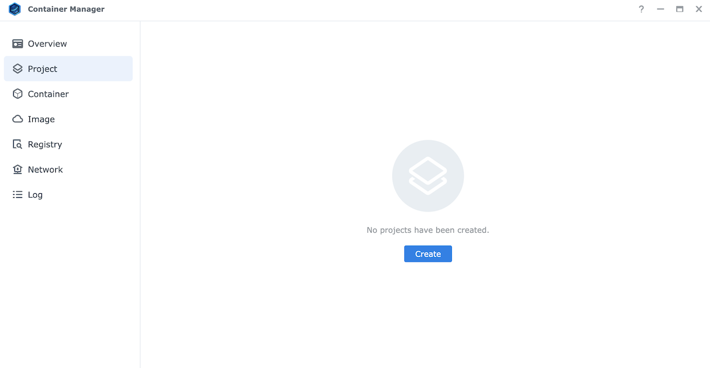
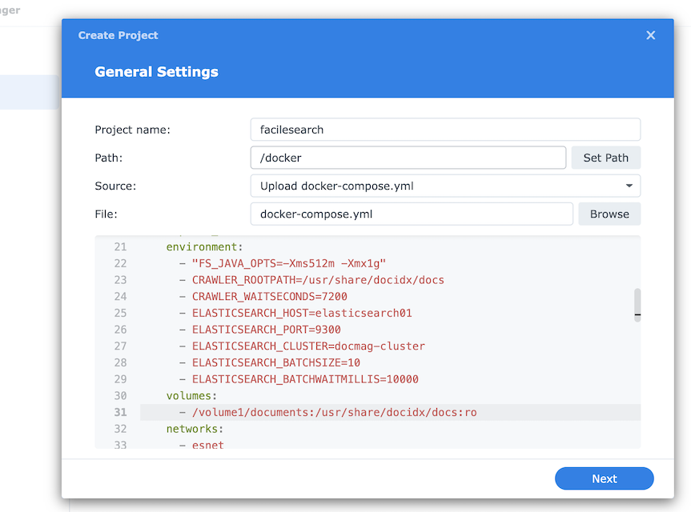
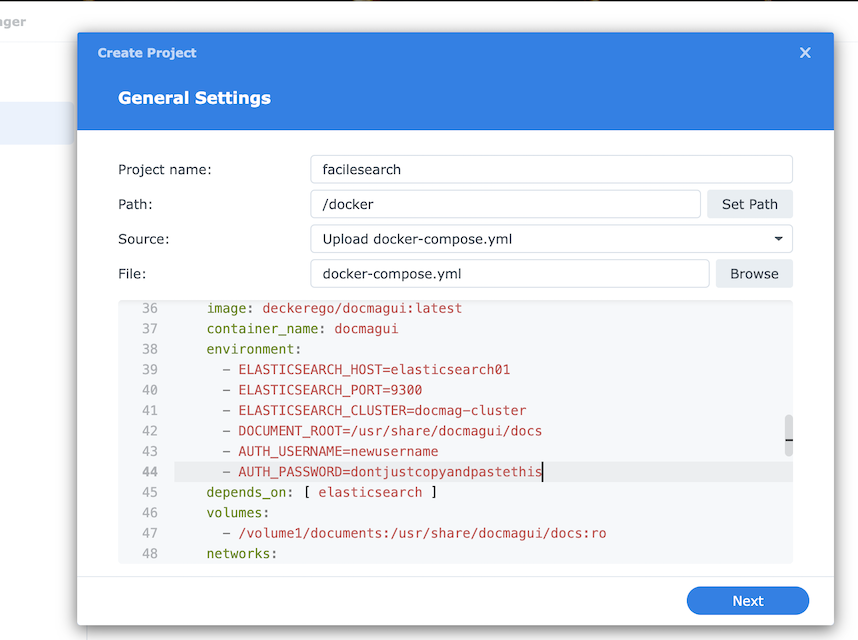
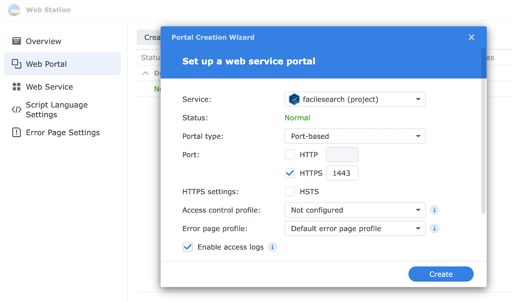
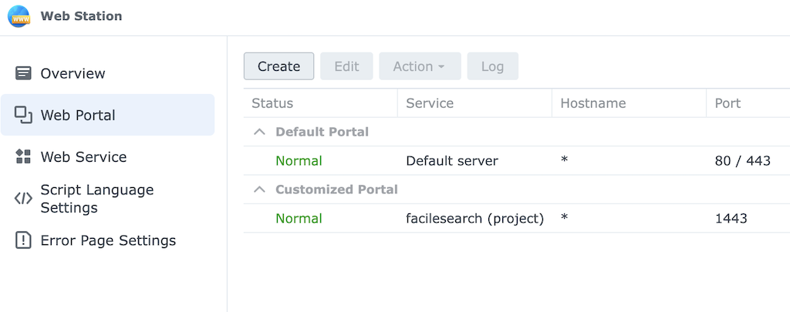
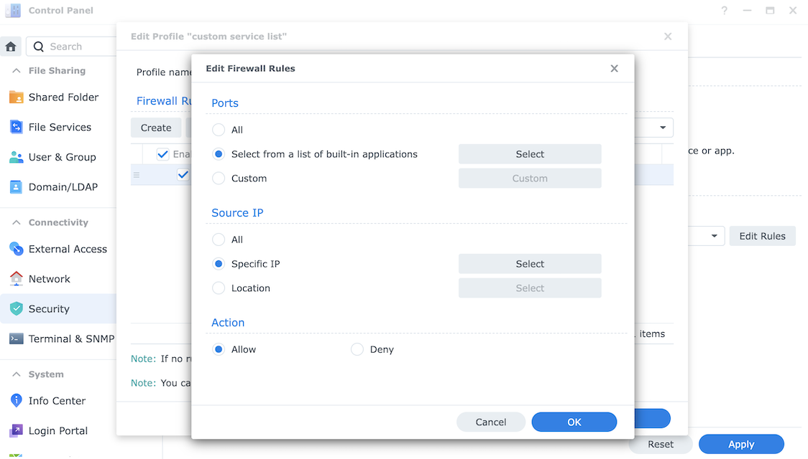
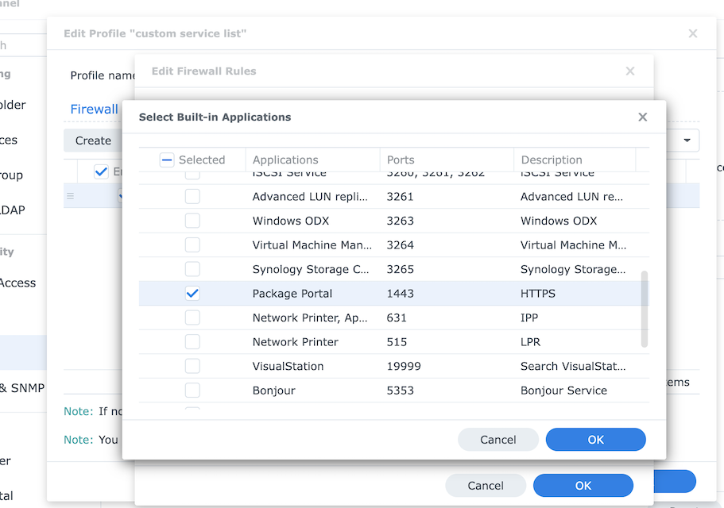
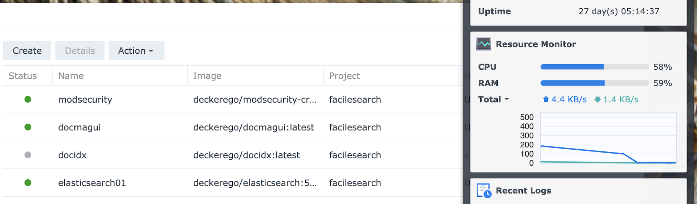
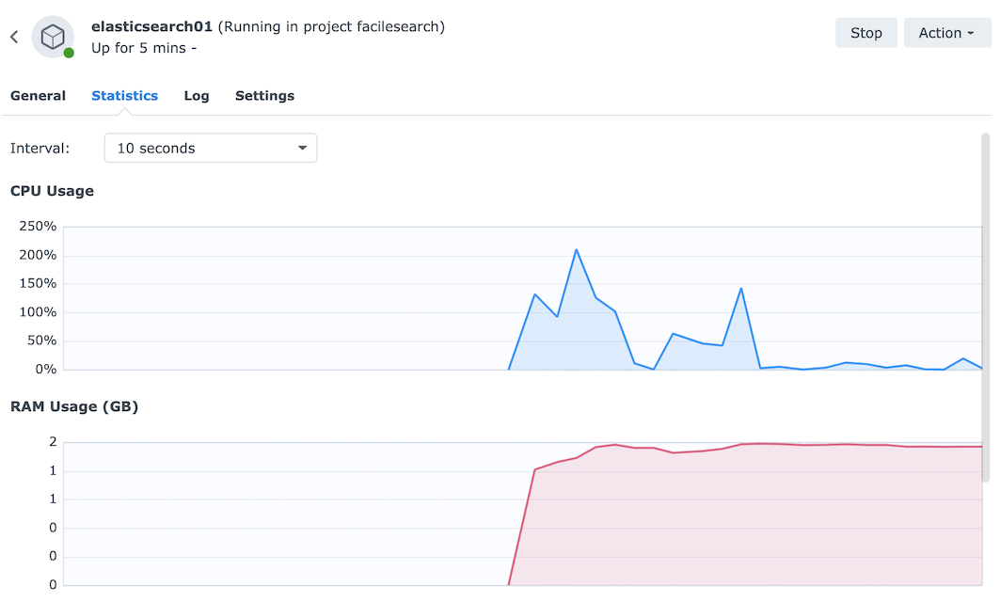

## Running Facile Search With Synology's Docker Support

With the latest Container Manager updates, Synology is now capable of hosting Docker Compose "projects" as a web service. Previously you would need to manually set up networks, storage volumes, SSL certificates & all the rest manually - now it is a point-and-click adventure through the Container Manager and Web Station.

### Creating the Container Manager Project

First open the Synology Container Manager and launch the "Project" tab:

Once the Project tab is open, set the local path to upload the Docker Compose YAML file into, upload the `docker-compose.yml` file from this repository, and give this project a name.

This is a good time to set the `CRAWLER_WAITSECONDS` variable to a reasonable value, set the location of the directory you would like to crawl on your NAS (e.g. `/volume1/documents`), and set your new username and password.

### Creating the Web Station Entry

After creating the Container Manager project you will be prompted to go to Web Station to configure a web service for the project. If Web Station is not already installed, you will be sent to the application manager to install it.

The web service itself will be automatically generated, and then you will be promted to create the HTTP endpoint to expose it within the Web Portal tab. Create a port-based endpoint on 1443 using HTTPS only.

After creating the Web Portal entry, it should be listed as a "Customized Portal":

### Adding a Firewall Rule

Web Station is exposed as the "Package Portal" application within the Synology firewall settings. To grant access to the port-based HTTP endpoint you just created, navigate to the Firewall -> Custom Service List -> Edit Rules section within Synology settings.

As you go through the list of registered services, find the "Package Portal" entry that has the port you just created in Web Station (the earlier example used port 1443). Select this port, then apply the rules.

### Monitoring the Containers

Depending on internet speed it may take a few minutes to start the project. Watch the container monitor within the Container Manager to ensure all the containers have a "green" status. If docidx goes grey that may be an indication that Elasticsearch didn't start quickly enough - start it once again and ensure you now have four green containers.

It doesn't hurt to monitor memory usage of the containers, especially Elasticsearch and docidx:

Once everything is green, you can launch Facile Search via HTTPS on port 443!
